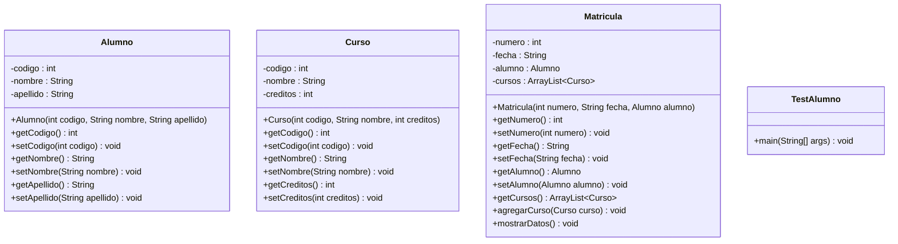

```mermaid
classDiagram
    class Alumno {
        -codigo : int
        -nombre : String
        -apellido : String
        +Alumno(int codigo, String nombre, String apellido)
        +getCodigo() int
        +setCodigo(int codigo) void
        +getNombre() String
        +setNombre(String nombre) void
        +getApellido() String
        +setApellido(String apellido) void
    }
    class Curso {
        -codigo : int
        -nombre : String
        -creditos : int
        +Curso(int codigo, String nombre, int creditos)
        +getCodigo() int
        +setCodigo(int codigo) void
        +getNombre() String
        +setNombre(String nombre) void
        +getCreditos() int
        +setCreditos(int creditos) void
    }
    class Matricula {
        -numero : int
        -fecha : String
        -alumno : Alumno
        -cursos : ArrayList~Curso~
        +Matricula(int numero, String fecha, Alumno alumno)
        +getNumero() int
        +setNumero(int numero) void
        +getFecha() String
        +setFecha(String fecha) void
        +getAlumno() Alumno
        +setAlumno(Alumno alumno) void
        +getCursos() ArrayList~Curso~
        +agregarCurso(Curso curso) void
        +mostrarDatos() void
    }
    class TestAlumno {
        +main(String[] args) void
    }
```
