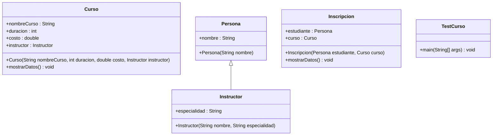

```mermaid
classDiagram
    class Curso {
        +nombreCurso : String
        +duracion : int
        +costo : double
        +instructor : Instructor
        +Curso(String nombreCurso, int duracion, double costo, Instructor instructor)
        +mostrarDatos() void
    }
    class Persona {
        +nombre : String
        +Persona(String nombre)
    }
    class Instructor {
        +especialidad : String
        +Instructor(String nombre, String especialidad)
    }
    Persona <|-- Instructor
    class Inscripcion {
        +estudiante : Persona
        +curso : Curso
        +Inscripcion(Persona estudiante, Curso curso)
        +mostrarDatos() void
    }
    class TestCurso {
        +main(String[] args) void
    }
```
