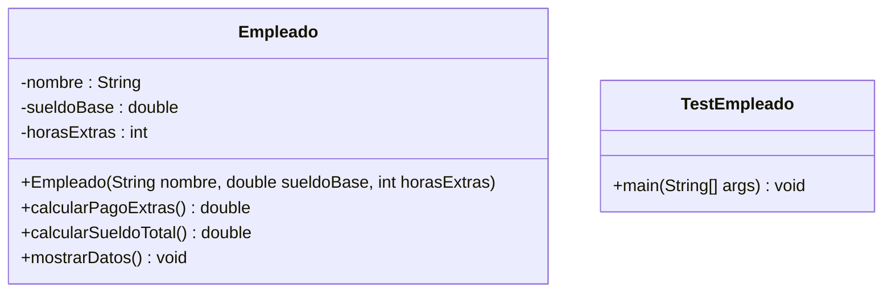

```mermaid
classDiagram
    class Empleado {
        -nombre : String
        -sueldoBase : double
        -horasExtras : int
        +Empleado(String nombre, double sueldoBase, int horasExtras)
        +calcularPagoExtras() double
        +calcularSueldoTotal() double
        +mostrarDatos() void
    }
    class TestEmpleado {
        +main(String[] args) void
    }
```
