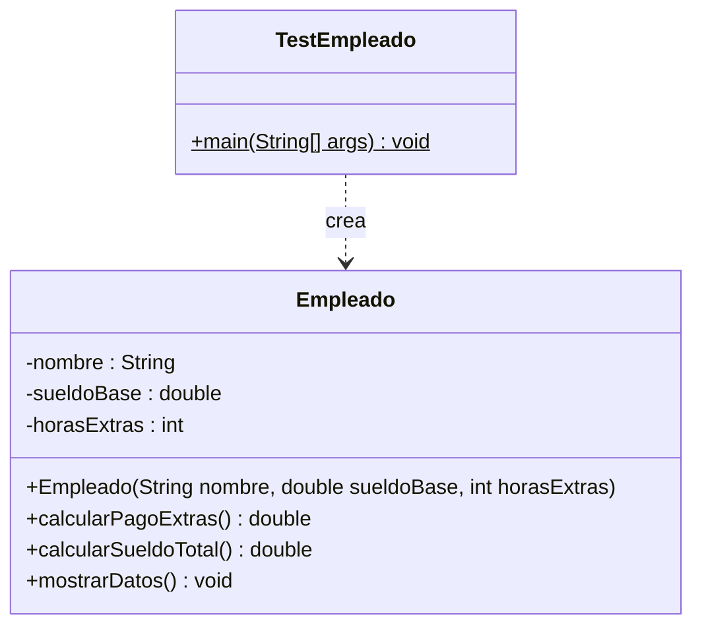

```mermaid
classDiagram
%% fuente: 61f9316ff22e720af56ac7ac3b51afc2f48b4a7e4466a1822ed630bb8a32cef0
    class Empleado {
        -nombre : String
        -sueldoBase : double
        -horasExtras : int
        +Empleado(String nombre, double sueldoBase, int horasExtras)
        +calcularPagoExtras() double
        +calcularSueldoTotal() double
        +mostrarDatos() void
    }
    class TestEmpleado {
        +main(String[] args) void$
    }
    TestEmpleado ..> Empleado : crea
```
